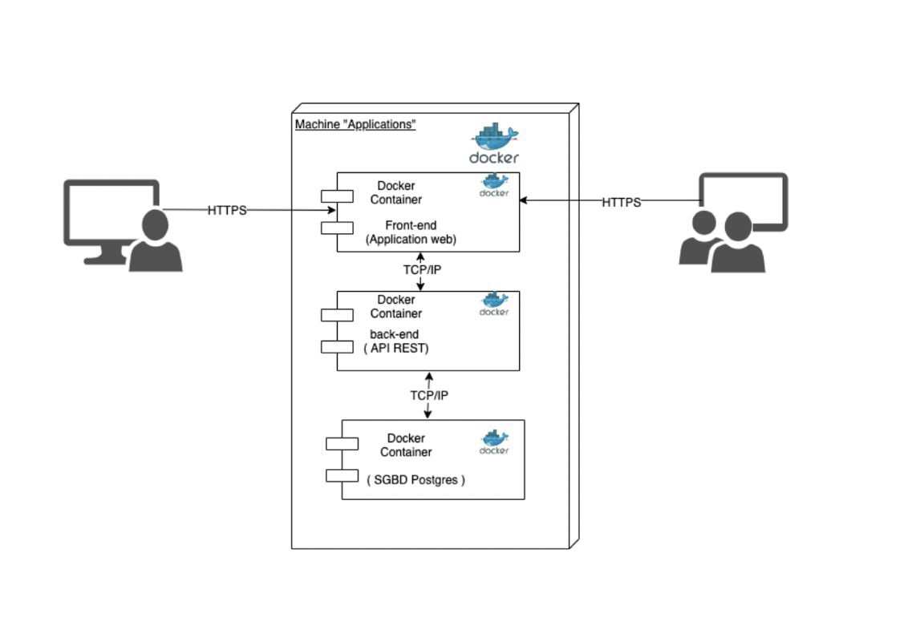

# Technical Stack Document - INSTAMINT

## 1. Context

This technical stack document aims to describe the architecture proposed for the development of a social sharing web platform around NFTs. This platform will allow users to share, explore and interact with unique digital content authenticated by NFTs (Non-Fungible Tokens). The concept is a blend of Instagram and web3 technologies, providing an immersive and secure experience in the world of unique digital assets.

## 2. Technologies to Use

#### Front-End

- Angular: JavaScript framework for building dynamic web applications.
- Bootstrap: CSS framework for rapid and responsive development.
- HTML / CSS: Markup and style languages ​​for structuring and formatting web content.
- TypeScript: Typed programming language that integrates well with Angular and improves code quality.

#### Back-End

- NestJs: Node.js framework for building RESTful APIs with a modular and scalable architecture.
- Postgres: Relational database management system for data storage.

#### Deployment

- Vercel: Continuous deployment platform for the deployment and hosting of web applications.
- CI/CD with Docker: Continuous integration and continuous deployment with Docker containers for efficient infrastructure management.

#### Mobile app

- PWA: for the mobile application, offering a user experience similar to that of a native application, but accessible via a web browser.

#### Version Management

- GitHub: Software development platform offering version control, collaboration and project management features.

#### Project management

- Jira: Agile project management tool for planning, monitoring and collaboration.

## 3. Technical architecture

The platform architecture will be based on a classic client-server architecture, with an Angular front-end that communicates with a NestJs back-end via RESTful APIs. The Postgres database will be used to store user data, NFT metadata, and other relevant information.

### 4. Production Planning

The platform creation schedule will include the following stages:

- Design and Modeling: Definition of requirements, architecture design and data modeling. _(Weeks 1-2)_
- Front-End Development: Implementation of the user interface with Angular and Bootstrap. _(Weeks 2-3)_
- Back-End Development: Creation of the RESTful API with NestJs and integration with the Postgres database. _(Weeks 2-3)_
- Integration and Tests: Integration of front-end and back-end components, unit tests and integration tests. _(Weeks 2-3)_
- Development of user stories, code review, sprint routing and writing of sprint reports. _(Weeks 2-11)_
- Deployment and Launch: Configuration of the CI/CD pipeline, deployment on Vercel and launch of the platform. _(Weeks 11)_

### 5. Risks

Some potential risks associated with platform development include:

- Data Security: Protecting user data and digital assets from attacks and security breaches.
- Scalability: Load management and scalability of the platform as the number of users and content increases.

### 6. Costs

Costs associated with platform development will include the following expenses:

- Human resources: Salaries of developers, architects, testers, etc.
- Cloud infrastructures: Hosting costs on Vercel and associated services.
- Development tools: Software licenses, GitHub subscriptions, etc.

## In summary

This technical architecture document provides an overview of the proposed design for the social sharing platform around NFTs. By following this architecture and effectively managing risks and costs, the development team will be able to create a robust, scalable and secure platform that meets user needs in the domainb of ​​unique digital assets.
